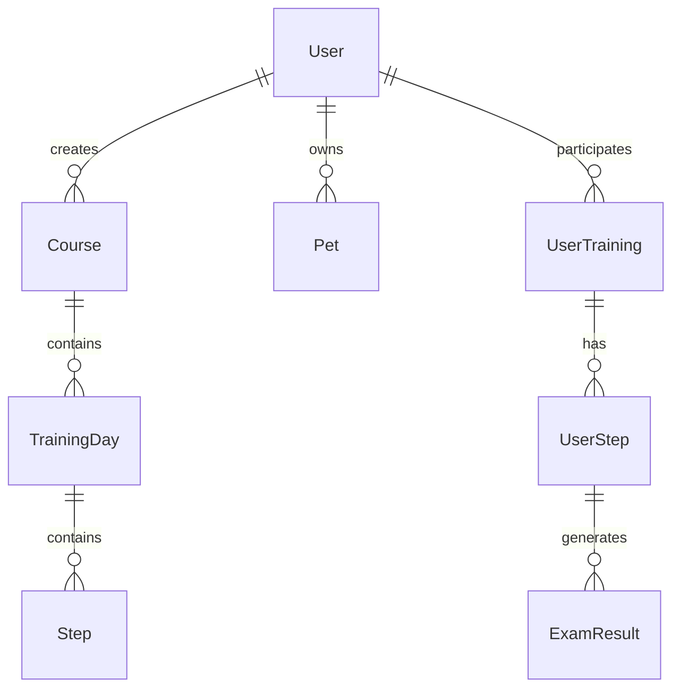

# Архитектура системы GAFUS

## 🏗️ Общая архитектура

### Monorepo структура

Проект использует подход monorepo с разделением на приложения и пакеты:

```
gafus/
├── apps/                    # Микрофронтенды
│   ├── web/                # Основное веб-приложение
│   ├── trainer-panel/      # Панель тренера
│   ├── telegram-bot/       # Telegram бот
│   ├── error-dashboard/    # Мониторинг ошибок
│   └── bull-board/         # Мониторинг очередей
├── packages/               # Общие пакеты
│   ├── prisma/            # База данных
│   ├── auth/              # Аутентификация
│   ├── logger/            # Логирование
│   ├── types/             # Типы TypeScript
│   └── ...                # Другие пакеты
└── ci-cd/                 # Конфигурация развертывания
```

## 🔄 Архитектурные паттерны

### 1. Микросервисная архитектура

Каждое приложение является независимым микросервисом:

- Собственная база данных (через общий Prisma пакет)
- Независимое развертывание
- Слабая связанность между сервисами

### 2. Shared Libraries Pattern

Общие пакеты обеспечивают:

- Переиспользование кода
- Единообразие интерфейсов
- Централизованное управление зависимостями

### 3. Event-Driven Architecture

- Очереди BullMQ (@gafus/queues): push, reengagement, video-transcoding, exam-cleanup
- Worker (@gafus/worker) обрабатывает задачи; Bull Board — мониторинг

## 🌐 Сетевая архитектура

### Frontend Layer

```
┌─────────────────┐    ┌─────────────────┐    ┌─────────────────┐
│   Web App       │    │  Trainer Panel  │    │ Error Dashboard │
│   (Port 3002)   │    │   (Port 3001)   │    │   (Port 3000)   │
└─────────────────┘    └─────────────────┘    └─────────────────┘
         │                       │                       │
         └───────────────────────┼───────────────────────┘
                                 │
                    ┌─────────────────┐
                    │   Nginx Proxy   │
                    │  (Load Balancer)│
                    └─────────────────┘
```

### Backend Layer

```
┌─────────────────┐    ┌─────────────────┐    ┌─────────────────┐
│  Telegram Bot   │    │   Bull Board    │    │   Worker        │
│   (Background)  │    │  (Port 3003)    │    │  (Background)   │
└─────────────────┘    └─────────────────┘    └─────────────────┘
         │                       │                       │
         └───────────────────────┼───────────────────────┘
                                 │
                    ┌─────────────────┐
                    │   Redis Queue   │
                    │   (Port 6379)   │
                    └─────────────────┘
```

### Data Layer

```
┌─────────────────┐    ┌─────────────────┐    ┌─────────────────┐
│   PostgreSQL    │    │      Redis      │    │     AWS S3      │
│   (Port 5432)   │    │   (Port 6379)   │    │   (File Store)  │
└─────────────────┘    └─────────────────┘    └─────────────────┘
```

## 📦 Управление зависимостями

### Workspace Configuration

```yaml
# pnpm-workspace.yaml
packages:
  - apps/*
  - packages/*
```

### Build Pipeline

```json
// turbo.json
{
  "tasks": {
    "build": {
      "dependsOn": ["^build", "prisma:generate"],
      "outputs": [".next/**", "dist/**"]
    },
    "dev": {
      "dependsOn": ["prisma:generate"],
      "persistent": true
    }
  }
}
```

## 🔐 Безопасность

### Аутентификация Flow

```
┌─────────────┐    ┌─────────────┐    ┌─────────────┐
│   Client    │───▶│  NextAuth   │───▶│   Database  │
│  (Browser)  │    │  (JWT)      │    │  (Users)    │
└─────────────┘    └─────────────┘    └─────────────┘
```

### Авторизация

- Ролевая модель (RBAC)
- Middleware для проверки прав доступа
- CSRF токены для защиты форм

## 📊 Обработка данных

### Database Schema



### Data Flow

1. **User Registration** → Database
2. **Course Creation** → Database + CDN (images)
3. **Training Progress** → Database + Cache (Redis)
4. **Notifications** → Queue (BullMQ) → Telegram/Push

## 🔄 Обработка очередей

### Queue Architecture

```
┌─────────────┐    ┌─────────────┐    ┌─────────────┐
│   Producer  │───▶│    Queue    │───▶│  Consumer   │
│  (App)      │    │   (Redis)   │    │ (Worker)    │
└─────────────┘    └─────────────┘    └─────────────┘
```

### Типы задач

- **Push Notifications** - Уведомления пользователям
- **Email Sending** - Отправка писем
- **File Processing** - Обработка загруженных файлов
- **Data Export** - Экспорт данных

## 🌍 Развертывание

### Docker Architecture

```yaml
# docker-compose.prod.yml
services:
  web:
    build: ./ci-cd/docker/Dockerfile-web-optimized
    ports: ["3002:3000"]

  trainer-panel:
    build: ./ci-cd/docker/Dockerfile-trainer-panel-optimized
    ports: ["3001:3000"]

  nginx:
    build: ./ci-cd/nginx
    ports: ["80:80", "443:443"]
```

### Environment Configuration

- **Development** - Локальная разработка
- **Staging** - Тестовое окружение
- **Production** - Продакшн сервер

## 📈 Масштабирование

### Горизонтальное масштабирование

- Каждый сервис может масштабироваться независимо
- Load balancer для распределения нагрузки
- Database replication для высокой доступности

### Вертикальное масштабирование

- Увеличение ресурсов для каждого контейнера
- Оптимизация запросов к базе данных
- Кэширование на разных уровнях

## 🔍 Мониторинг

### Логирование

```
┌─────────────┐    ┌─────────────┐    ┌─────────────┐
│   App 1     │    │   App 2     │    │   App N     │
│             │    │             │    │             │
└──────┬──────┘    └──────┬──────┘    └──────┬──────┘
       │                  │                  │
       └──────────────────┼──────────────────┘
                          │
                ┌─────────────┐
                │   Logger    │
                │  (Central)  │
                └─────────────┘
```

### Метрики

- **Application Metrics** - Производительность приложений
- **Database Metrics** - Запросы и соединения
- **Queue Metrics** - Размер очередей и время обработки
- **Error Tracking** - Отслеживание ошибок

## Дополнительная документация

- [Система кэширования](./caching-system.md)
- [Управление переменными окружения](./ENV_MANAGEMENT.md)
- [Структура пакетов](./PACKAGE_STRUCTURE_ANALYSIS.md)
- [Архитектура логирования](./logging-architecture.md)
- [Pino vs Loki](./LOGGER_VS_LOKI.md), [сравнение логирования](./LOGGING_COMPARISON.md)
- [HLS-защита видео](./hls-video-protection.md)

---

_Архитектура системы спроектирована для обеспечения высокой производительности, масштабируемости и надежности._
