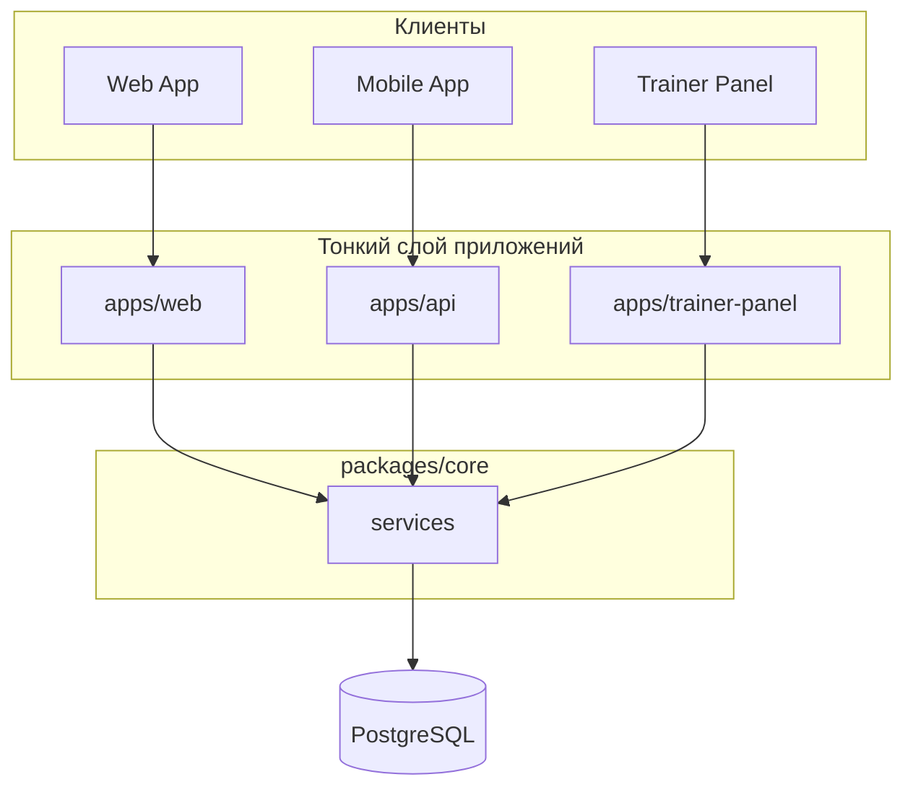

# Архитектура: обзор слоёв

## Core как ядро

Вся бизнес-логика сосредоточена в `packages/core`. Приложения (web, api) — тонкие слои: валидация входа → вызов core → формирование ответа.

## Правила

1. **Бизнес-логика** — только в `packages/core`. Apps не содержат доменной логики, только orchestration.
2. **Патерн слоя:** validate (Zod) → call core → shape response. Никакого прямого prisma в apps (кроме health check).
3. **Контракты API** для mobile не меняются — core возвращает структуры, совместимые с текущими ответами.

## Пакеты

| Пакет | Роль |
|-------|------|
| `@gafus/core` | Бизнес-логика: course, training, user, pets, tracking, subscriptions, payments, auth, consent и др. |
| `@gafus/auth` | Инфраструктура аутентификации: JWT, refresh tokens, NextAuth providers |
| `@gafus/video-access` | Проверка доступа к видео, подпись URL |
| `@gafus/cdn-upload` | Загрузка файлов в CDN |
| `@gafus/prisma` | База данных, миграции, ORM |
| `@gafus/logger` | Логирование (Pino → Seq) |
| `@gafus/csrf` | CSRF-защита |
| `@gafus/queues` | BullMQ очереди |

## Связанные документы

- [Поток данных](./data-flow.md)
- [Матрица миграции](./core-migration-matrix.md)
- [apps/web](../apps/web.md), [apps/api](../apps/api.md)
